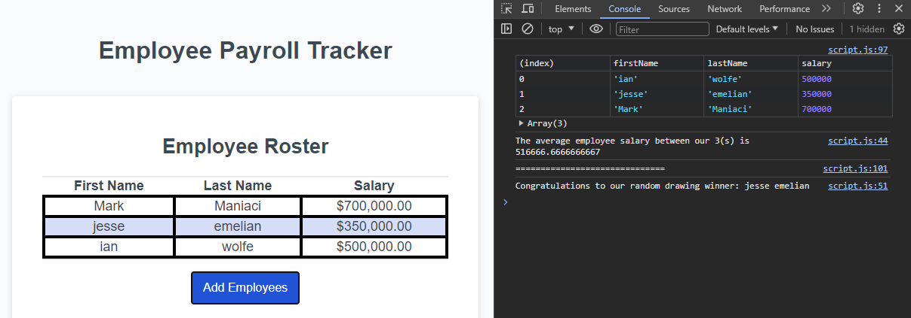

# c03-employee-data
## Description

The goal of this was to fix the provided code so that the application is able to, once the button is clicked,
track the entered employee information (name, last name, and salary) and provide an average to the salaries provided.

The low amount of commits for this repo is due to me having to move the repo from https://github.com/enkw/c03-employee-data in an attempt to fix an issue I was having with github pages.

## Table of Contents (Optional)

N/A

## Installation

N/A

## Usage

Select the "Add Employees" button to be promted to enter the first name, last name, and salary of as many employees as you'd like. Once finished this will print the average of the salaries given, as well as a random employee for a potential contest, to the console.

    

## Credits

Ian Wolfe, Bryan Lebeuf, and all the MDN articles I stared at to get this working.

## License

N/A

## Badges

N/A

## Features

Takes entered data and adds them to an object. Once there, it uses this to figure out the average salaries and randomly selects an employee entered.

## How to Contribute

N/A

## Tests

N/A
